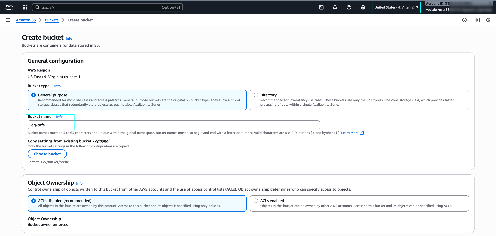
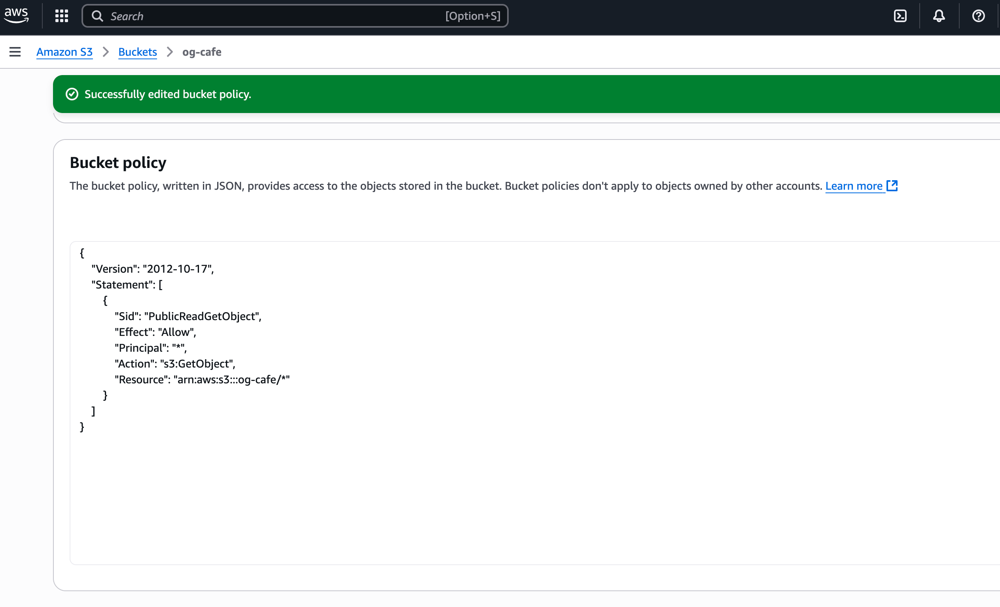

Challenge Lab: Creating a Static Website for the Café
===================================================================

In this lab, you will create a static website for a café using Amazon S3.

Lab Objectives
------------------

Lab Architecture
------------------

**Task 1: Extracting the files that you need for this lab**
--------------------------------------------------

1. Download the zip file containing the website files from the link.
  [here](https://aws-tc-largeobjects.s3.us-west-2.amazonaws.com/CUR-TF-200-ACACAD-3-113230/01-lab-mod4-challenge-S3/s3/scripts/static-website.zip)

2. Extract the contents of the zip file to a folder on your local machine.
3. The extracted folder should contain the following files:
   - index.html
   - styles.css
   - images (folder containing images)

--------------------------------------------------

**Task 2: Creating an S3 bucket to host your static website**
--------------------------------------------------

1. Sign in to the AWS Management Console and open the Amazon S3 console at <https://console.aws.amazon.com/s3>
2. Choose Create bucket.

> [!TIP] 
You must clear Block all public access and enable ACLs to create a public bucket.

3. Enable static website hosting on your bucket.

Task 3: Uploading content to your S3 bucket
--------------------------------------------------

In this task, you upload the static files to your S3 bucket.

**Task 4: Creating a bucket policy to grant public read access**
------------------------------------------------

- Create a bucket policy that grants read-only permission to public anonymous users by using the bucket policy editor.

> [!TIP] 
If you get stuck, see the examples in the AWS documentation references <a href="https://docs.aws.amazon.com/AmazonS3/latestuserguideHostingWebsiteOnS3Setuphtml#step4-add-bucket-policy-make-content-public">here</a>

Copy the policy below and replace "YOUR-BUCKET-NAME" with the name of your S3 bucket.

Congratulations! You now have a static website for the café.

---------------------------------------------------

# New business requirement: Enhancing data protection (challenge 3)

The café has a new business requirement to implement a strategy to prevent the accidental overwrite and deletion of website objects.

------------------------------------------------

**Task 5: Enabling versioning on the S3 bucket**

- In the Amazon S3 console, enable versioning on your S3 bucket.

> [!IMPORTANT] 
You cannot disable versioning on a bucket after you enable it. You can only suspend it.

In a text editor, open the index.html file, Modify the file according to the following instructions.
Locate the first line that has the embedded CSS code `bgcolor="aquamarine"` in the HTML, and change it to `bgcolor="gainsboro"`.

Locate the line that has the embedded CSS code `bgcolor="orange"` in the HTML, and change it to `bgcolor="cornsilk"`.

Locate the second line that has the embedded CSS code `bgcolor="aquamarine"` in the HTML, and change it to `bgcolor="gainsboro"`.

Save the changes.

- Upload the updated file to your S3 bucket.

To see the latest version of the index.html file, go to your bucket and choose Show versions. You should see both versions of this file listed.

- Reload the web browser tab with your website and notice the changes.

> [!TIP] 
Notice the change in the color of the second row media of the cafe website.

> [!IMPORTANT] 
Architecture Best practice: In this task, you used one technique to implement the architecture best practice of protecting your data.

According to the [AWS Well-Architected Framework](https://docs.aws.amazon.com/wellarchitected/latest/framework/welcome.html), versioning can be part of a larger data lifecycle management process. Before you architect any system, foundational practices that influence security should be in place. For example, data classification provides a way to categorize organizational data based on levels of sensitivity. Encryption protects data by rendering it unintelligible to unauthorized access. These tools and techniques are important because they support objectives such as preventing financial loss or complying with regulatory obligations.

--------------------------------------------------

# New business requirement: Optimizing costs of Amazon S3 object storage (challenge 4)

Now that you have enabled versioning, you realize that the size of the S3 bucket will continue to grow as you upload new objects and versions. To save costs, you decide to implement a strategy to retire some of those older versions.

**Task 6: Setting lifecycle policies:**

Configure two rules in the website bucket's lifecycle configuration. To receive full credit, create two separate rules. Do not configure two transitions in a single rule.

- In one rule, move previous versions of all source bucket objects to S3 Standard-IA after 30 days.

   

> [!WARNING] 
*Deletion Rule Below.*

- In the other rule, delete previous versions of the objects after 365 days.

    

> [!TIP]  
If you get stuck, see the [AWS S3 lifecycle configuration examples](https://docs.aws.amazon.com/AmazonS3/latest/userguide/lifecycle-configuration-examples.html) in the AWS documentation references.

We should now have a lifecycle configuration that moves previous versions of your source bucket objects to S3 Standard-IA after 30 days. The policy also permanently deletes the objects that are in S3 Standard-IA after 365 days.

--------------------------------------------------

Architecture best practice
In this task, you implemented the architecture best practice of defining data lifecycle management.

According to the [AWS Well-Architected Framework](https://docs.aws.amazon.com/wellarchitected/latest/framework/welcome.html), in practice, your lifecycle strategy should be based on the criticality and sensitivity of your data, and legal and organizational requirements. You should consider factors such as data retention duration, data destruction, data access management, data transformation, and data sharing.

# New business requirement: Enhancing durability and planning for DR (challenge 5)

The café has a new business requirement to enhance the durability of the website data and plan for disaster recovery (DR) by replicating the website data to another AWS Region.

Cross-Region replication is another feature of Amazon S3 that you can also use to back up and archive critical data.

**Task 7: Enabling cross-Region replication:**
In this task, you enable cross-Region replication on your source S3 bucket.

- In a different Region than the Region for your source bucket, create a second bucket and enable versioning on it. The second bucket is your destination bucket.

Choose create bucket.

> [!TIP]
On the prompt about Replicate existing objects?, choose No...

If you get stuck, see the [AWS Documentation](https://docs.aws.amazon.com/AmazonS3/latest/user-guide/enable-replication.html#enable-replication-add-rule) for guidance.

Make a minor change to the index.html file, and upload the new version to your source bucket.

Verify that the source `ogd-cafe` bucket now has three versions of the index.html file.

**Note:**  Confirm that the new object was replicated to your destination `og-cafe-2` bucket. You might need to reload the browser tab.

*Architecture best practice  
In this task, we implemented the architecture best practice of automating disaster recovery*.

According to the [Well-Architected Framework](https://docs.aws.amazon.com/wellarchitected/latest/framework/welcome.html), the start of our DR strategy is having backups and redundant workload components in place.

--------------------------------------------------

**Lab complete**  
Congratulations! You have completed the lab.