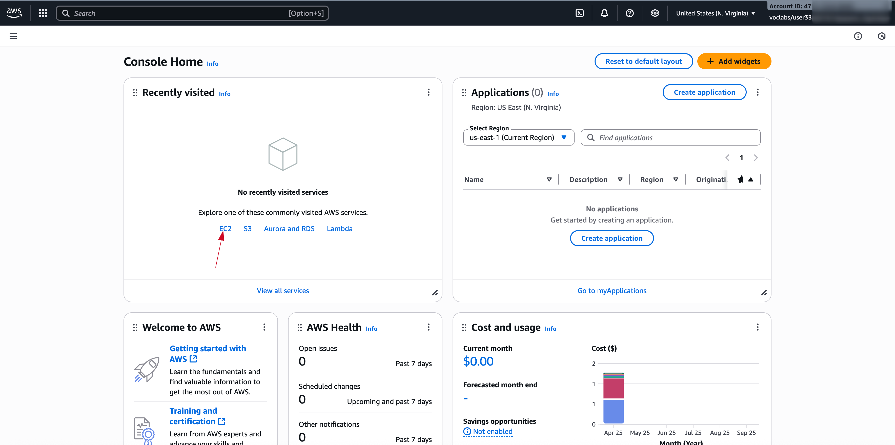
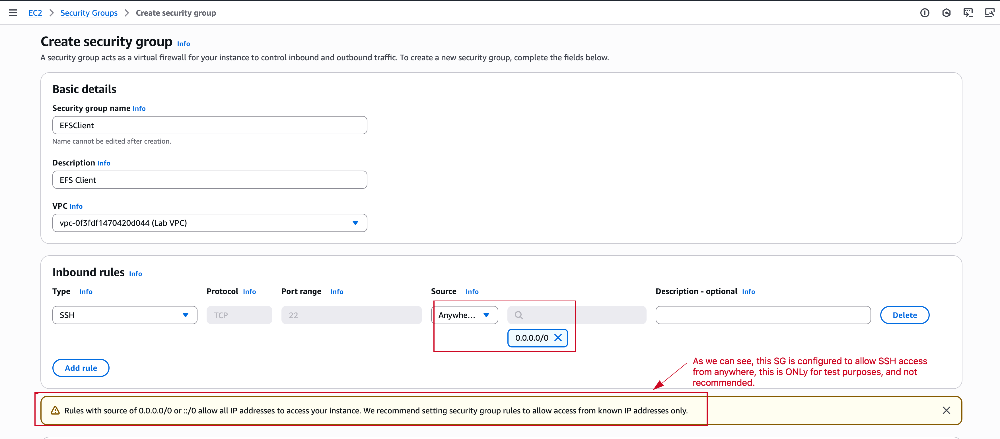
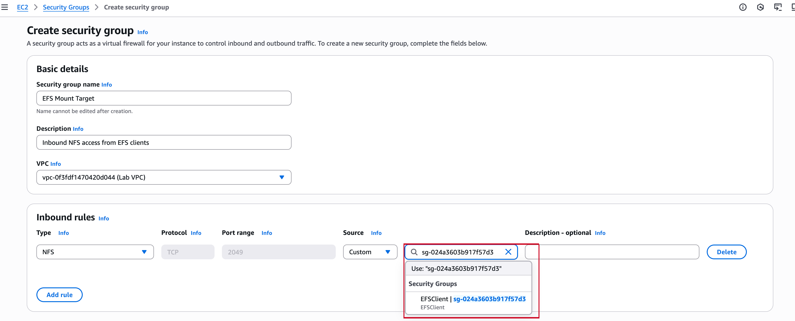
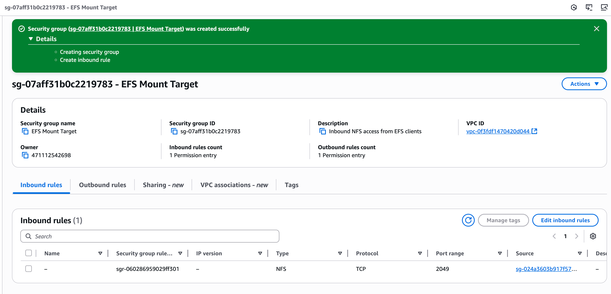
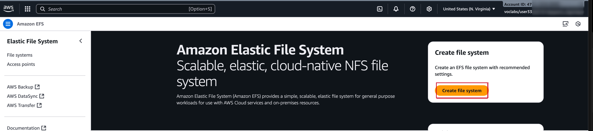
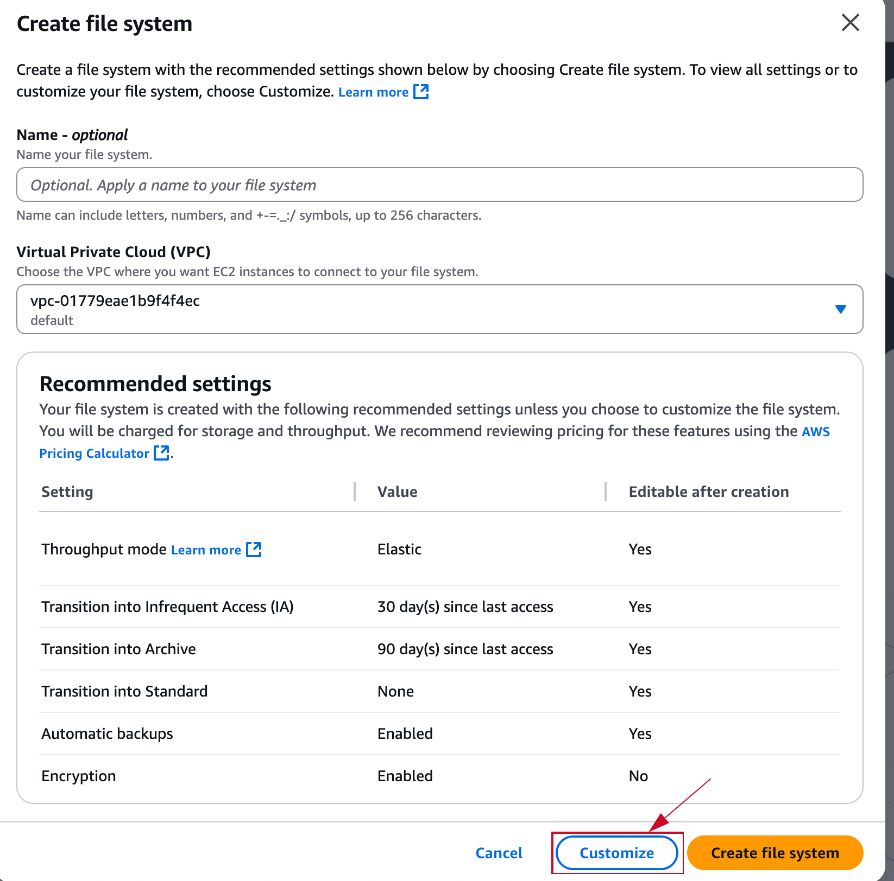

Task 1: Creating a security group to access your EFS file system
===========================
The security group that you associate with a mount target must allow inbound access for TCP on port 2049 for Network File System (NFS). This is the security group that you will now create, configure, and attach to your EFS mount targets.

1. At the top of the AWS Management Console, in the search box, search for and choose EC2.

2. In the navigation pane, under Network & Security, choose Security Groups.

3. Choose Create security group.

For Security group name and description, enter **EFSClient**, and cchoose the below configuration:

4. Scroll down, Click Create and Copy the Security group ID of the EFSClient security group to your text editor.

> [!IMPORTANT]  
 The Group ID should look similar to sg-03727965651b6659b. 

5. Let's Create another Security group for the **Mount Target** Choose Create security group then configure:

- In the Custom box, paste the security group's Security group ID that you copied to your text editor, as seen below:

Under the Inbound rules section, choose Add rule then configure:

- Type: NFS

- Source: Custom

Choose Create security group.

Task 2: Creating an EFS file system
===========================
EFS file systems can be mounted to multiple EC2 instances that run in different Availability Zones in the same Region. These instances use mount targets that are created in each Availability Zone to mount the file system by using standard NFSv4.1 semantics. You can mount the file system on instances in only one virtual private cloud (VPC) at a time. Both the file system and the VPC must be in the same Region.

1. At the top of the AWS Management Console, in the search box, search for and choose EFS. 

- Choose Create file system.

> [!TIP]  
In the Create file system window, choose Customize.

Congratulations! You have created a new EFS file system in your Lab VPC and mount targets in each Lab VPC subnet. In a few seconds, the File system state of the file system will change to Available, followed by the mount targets 2–3 minutes later.

Task 3: Connecting to your EC2 instance
===========================

In this task, you will connect to your EC2 instance by using AWS Systems Manager Session Manager sign-in URL.

Task 4: Creating a new directory and mounting the EFS file system
===========================
Amazon EFS supports the NFSv4.1 and NFSv4.0 protocols when it mounts your file systems on EC2 instances. Though NFSv4.0 is supported, we recommend that you use NFSv4.1. When you mount your EFS file system on your EC2 instance, you must also use an NFS client that supports your chosen NFSv4 protocol. The EC2 instance that was launched as a part of this lab includes an NFSv4.1 client, which is already installed on it.

Task 5: Examining the performance behavior of your new EFS file system
===========================
Examining the performance by using Flexible IO
 Flexible IO (fio) is a synthetic I/O benchmarking utility for Linux. It is used to benchmark and test Linux I/O subsystems. During boot, fio was automatically installed on your EC2 instance.

Monitoring performance by using Amazon CloudWatch
===========================