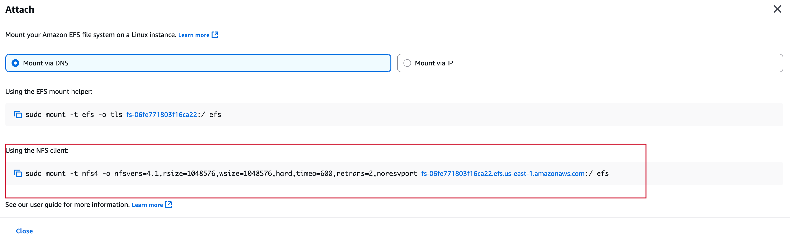
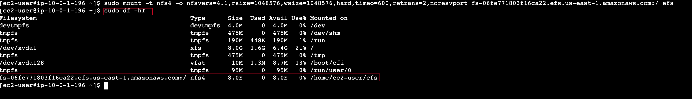

Task 1: Creating a security group to access your EFS file system
===========================
The security group that you associate with a mount target must allow inbound access for TCP on port 2049 for Network File System (NFS). This is the security group that you will now create, configure, and attach to your EFS mount targets.

1. At the top of the AWS Management Console, in the search box, search for and choose EC2.


2. In the navigation pane, under Network & Security, choose Security Groups.

3. Choose *Create* security group.

For Security group name and description, enter **EFSClient**, and cchoose the below configuration:


4. Scroll down, Click *Create* and Copy the Security group ID of the EFSClient security group to your text editor.

> [!IMPORTANT]  
 The Group ID should look similar to sg-03727965651b6659b. 

5. Let's *Create* another Security group for the **Mount Target** Choose *Create* security group then configure:

- In the Custom box, paste the security group's Security group ID that you copied to your text editor, as seen below:


Under the Inbound rules section, choose Add rule then configure:

- Type: NFS

- Source: Custom

Choose *Create* security group.

Task 2: Creating an EFS file system
===========================
EFS file systems can be mounted to multiple EC2 instances that run in different Availability Zones in the same Region. These instances use mount targets that are created in each Availability Zone to mount the file system by using standard NFSv4.1 semantics. You can mount the file system on instances in only one virtual private cloud (VPC) at a time. Both the file system and the VPC must be in the same Region.

1. At the top of the AWS Management Console, in the search box, search for and choose EFS. 

- Choose *Create* file system.


> [!TIP]  
In the Create file system window, choose Customize.


With the below configuration:
- On Step 1:

- - Uncheck  *Enable Automatic backups*.

- - - Lifecycle management:

- - for Transition into IA  Select *None*.

- In the Tags optional section, configure:

- - Key: *Name* Value: *My First EFS File System*


Choose Next.
- Attach the EFS Mount Target security group to each Availability Zone mount target by choosing EFS Mount Target for each Availability Zone.


For VPC, select Lab VPC.

Choose *Next*, Review your configuration and Choose *Create*.


*Congratulations*! You have created a new EFS file system in your Lab VPC and mount targets in each Lab VPC subnet. In a few seconds, the File system state of the file system will change to Available, followed by the mount targets 2–3 minutes later.


Task 3: Connecting to your EC2 instance
===========================

In this task, you will connect to your EC2 instance by using AWS Systems Manager Session Manager sign-in URL.

To connect to the EC2 instance: Go to instances in the EC2 console, select the instance, and then choose Connect.


Choose the *Session Manager* tab, and then choose *Connect*.


You should now be connected to the instance.


Task 4: Creating a new directory and mounting the EFS file system
===========================
Amazon EFS supports the NFSv4.1 and NFSv4.0 protocols when it mounts your file systems on EC2 instances. Though NFSv4.0 is supported, we recommend that you use NFSv4.1. When you mount your EFS file system on your EC2 instance, you must also use an NFS client that supports your chosen NFSv4 protocol. The EC2 instance that was launched as a part of this lab includes an NFSv4.1 client, which is already installed on it.

1. In the Session Manager terminal window, run the following command to switch to the ec2-user account:

```bash
sudo su -l ec2-user
```

- The amazon-efs-utils package includes the mount helper that simplifies the process of mounting EFS file systems and provides additional features, such as encryption of data in transit.

2. Run the following command to install the amazon-efs-utils package:

```bash
sudo yum install -y amazon-efs-utils
```

> [!TIP]  
To paste into the terminal in the browser, place your cursor just to the right of the command prompt and right-click to see the paste option.


Run the following command to create directory for mount:

```bash
sudo mkdir efs.
```


At the top of the AWS Management Console, in the search box, search for and choose EFS.
Choose My First EFS File System.
- In the Amazon EFS Console, on the top right corner of the page.
- -  choose Attach to open the Amazon EC2 mount instructions.




Get a full summary of the available and used disk space usage by entering:

```bash
sudo df -hT
```
This following screenshot is the output from the following disk filesystem command:


> [!TIP]  
Notice the Type and Size of your mounted EFS file system, similar to the following.
`fs-0e2e45d50de5916b3.efs.us-east-1.amazonaws.com:/ nfs4      8.0E     0  8.0E   0% /home/ec2-user/efs`

Task 5: Examining the performance behavior of your new EFS file system
===========================
Examining the performance by using Flexible IO
 Flexible IO (fio) is a synthetic I/O benchmarking utility for Linux. It is used to benchmark and test Linux I/O subsystems. During boot, fio was automatically installed on your EC2 instance.


Monitoring performance by using Amazon CloudWatch
===========================