# Lab: Creating an Amazon RDS Database

## Lab overview and objectives

Traditionally, creating a database can be a complex process that requires either a database administrator or a systems administrator. In the cloud, you can simplify this process by using Amazon Relational Database Service (Amazon RDS).

After completing this lab, you should be able to:

Create an Amazon RDS database.  

Configure a web application to connect to the database instance

## Lab Architecture

At the ***end*** of this lab, your architecture will look like the following example:

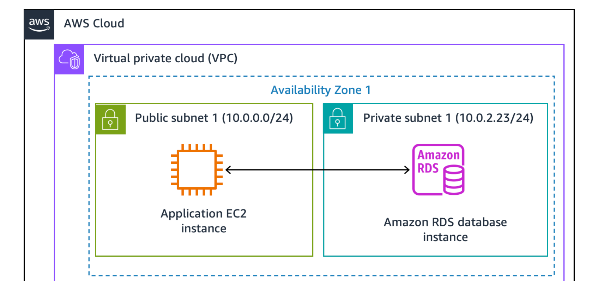
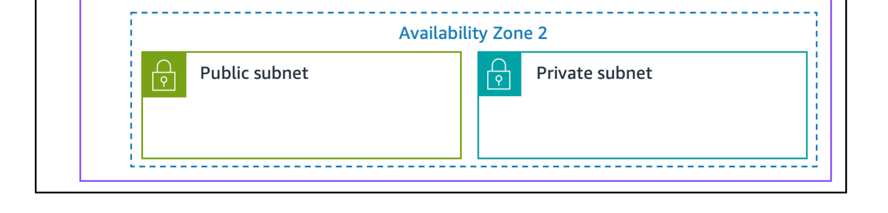

### Task 1: Creating an Amazon RDS database

In this task, you will create a MySQL database in your virtual private cloud (VPC). MySQL is a popular open source relational database management system (RDBMS), so there are no software licensing fees.

- At the top of the AWS Management Console, in the search box, enter and select *RDS*.

- Choose ***Create database***.

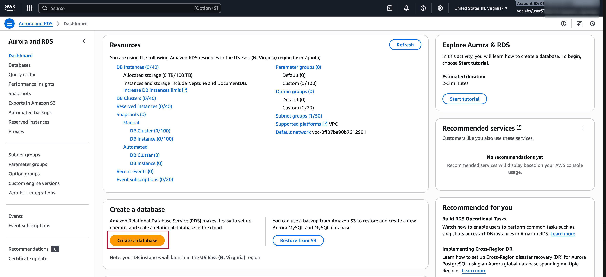

- Under ***Engine options***, select ***MySQL***.

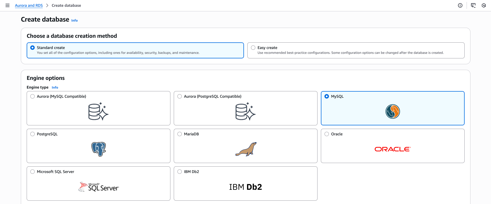

- The options include several use cases, ranging from enterprise-class databases to Dev/Test systems. In the options, you might notice Amazon Aurora. Aurora is a MySQL-compatible system that was re-architected for the cloud. If your company uses large-scale MySQL or PostgreSQL databases, Aurora can provide enhanced performance.

- Set the templates and availability and durability options:

  - Under the Templates section, select  Dev/Test.
  - Under the Availability and durability section, select   Single DB instance.

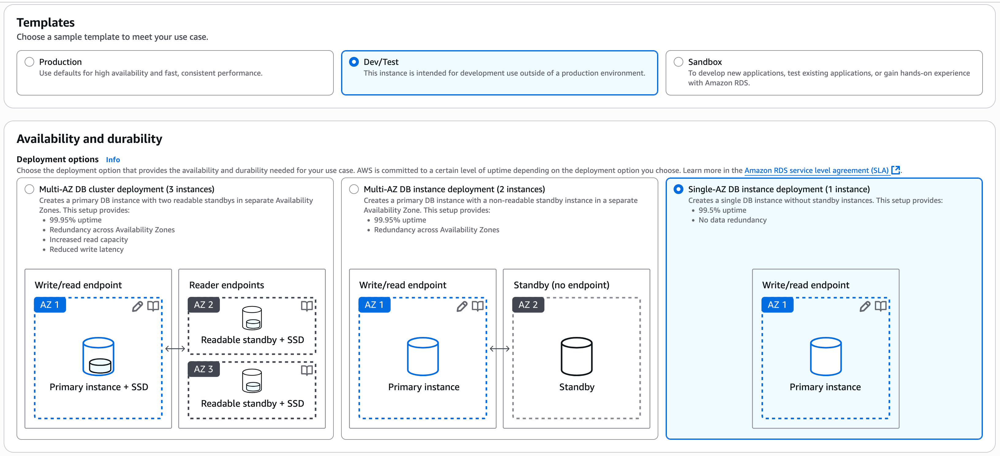

> [!TIP]  
Note: the default Multi-AZ deployment option automatically creates a replica of the database in a second Availability Zone for High Availability, however in this lab that is not needed.

- Under the Settings section, configure these options:

  - ***DB instance identifier***: `inventory-db`
  - ***Master username***: `admin`

- Under ***Credentials management***, choose ***Self managed*** and configure as follows:
  - Master password: lab-password
  - Confirm password: lab-password

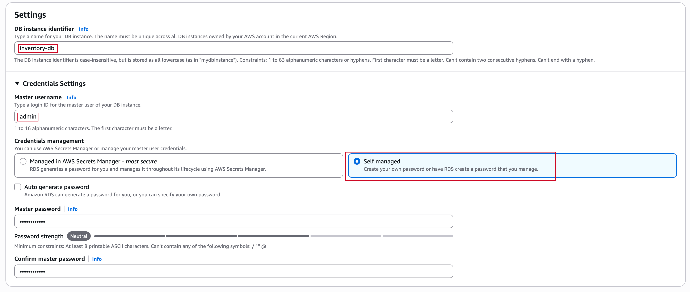

- Under the Instance configuration section, configure these options:
  - Select ***Burstable classes (includes t classes)***.
  - Select ***db.t3.micro***

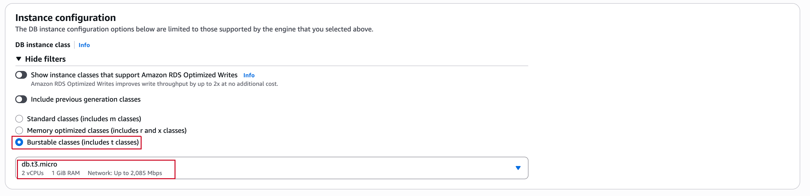

- In the Storage section next:
  - For ***Storage type*** choose ***General Purpose SSD (gp2)*** from the Dropdown menu.
  - For ***Allocated storage***  enter `20`.

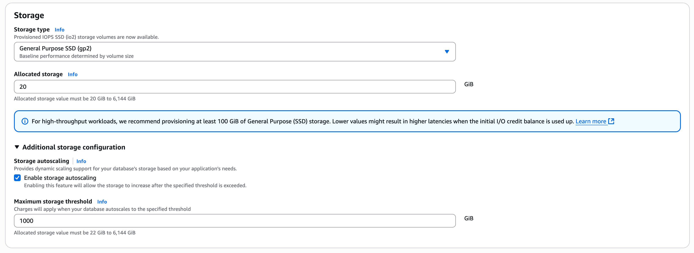

> [!TIP]  
For high-throughput workloads, we recommend provisioning at least 100 GiB of General Purpose (SSD) storage. Lower values might result in higher latencies when the initial I/O credit balance is used up. [Learn More](https://docs.aws.amazon.com/AmazonRDS/latest/UserGuide/CHAP_Storage.html#USER_PIOPS.StorageTypes).

- Expand ***Storage autoscaling*** and configure as follows:
  - Clear or Deselect ***Enable storage autoscaling***.

- Under the ***Connectivity*** section, configure these options:
  - ***Virtual Private Cloud (VPC)***: Lab VPC
  - ***DB subnet group***: Keep the default selection

> [!TIP]  
Note: The subnet group created as part of lab setup has two private subnets, one per Availability Zone (AZ). This is required by the RDS service, in case the user changes the configuration to Multi-AZ in future.

- Existing VPC security groups:
  - Choose `DB-SG`. It will be highlighted.
  - Remove the `default` security group

- Under Monitoring section, Clear (turn off) the Enable Enhanced monitoring option

- Expand the ***Additional configuration*** panel, then configure these settings:
  - ***Initial database name***: `inventory`

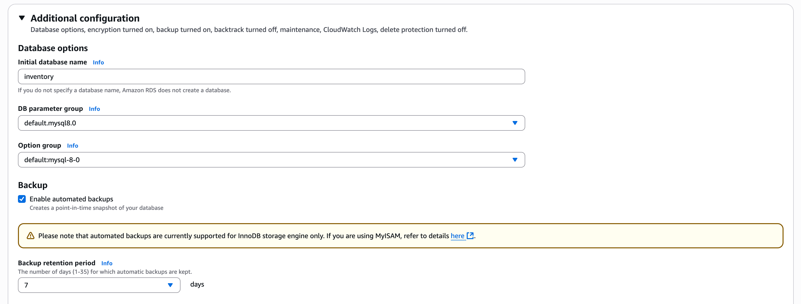

> [!TIP]  
his is the logical name of the database that will be used by the application.
Feel free to review the many other options displayed on the page, but leave them set to their default values. Options include automatic backups, the ability to export log files, and automatic version upgrades. The ability to activate these features through check boxes demonstrates the power of using a fully managed database solution instead of installing, backing up, and maintaining the database yourself.

- Choose Create database (at the bottom of the page).

  - You should receive a message indicating that your database is being created.

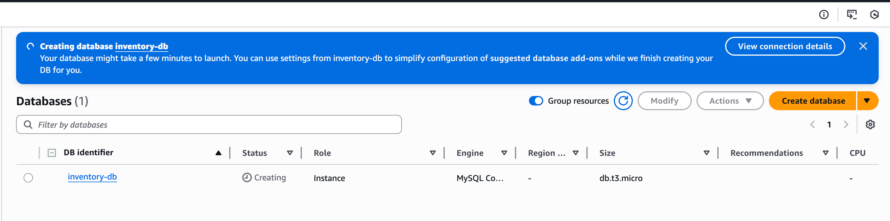

> [!IMPORTANT]  
Before you continue to the next task, the database instance status must be Available. This process might take several minutes.
*Note: If you receive a prompt Suggested add-ons for inventory-db, choose close*.

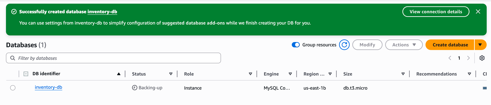

### Task 2: Configuring web application communication with a database instance

This lab automatically deployed an Amazon Elastic Compute Cloud (Amazon EC2) instance with a running web application. You must use the IP address of the instance to connect to the application.

Reference this documentation for more information about creating EC2 instances and hosting a dynamic application: [Dynamic Cafe Website](https://github.com/ogdmerlin/AWS-Cloud-Projects/blob/main/Dynamic-Website-Cafe/README.md).

- Search for ***EC2*** and copy the public IP address of the running instance tagged ***AppServer***.

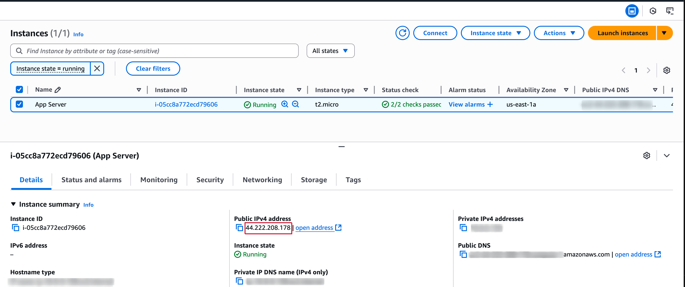

- Open a new web browser tab, paste the IP address you copied into the address bar, and then press ENTER.

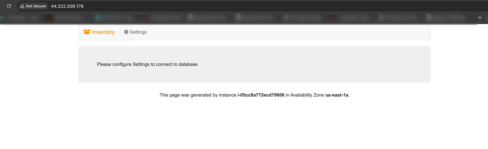

The web application should appear. It does not display much information because the application is not yet connected to the database.

- Choose Settings.
  - You can now configure the application to use the RDS DB instance you created earlier. You will first retrieve the Database Endpoint so that the application knows how to connect to a database.

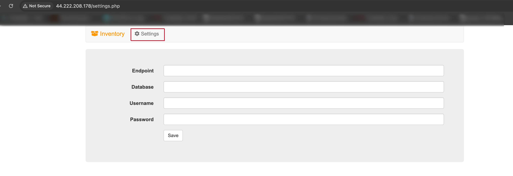

- Return to the AWS Management Console, but do not close the application tab. (You will return to it soon).

- From the  Services menu, choose RDS to open the RDS console.

- In the left navigation pane, choose Databases.

  - Choose inventory-db.

- Go to the Connectivity & Security section and copy the Endpoint to your clipboard.

- It should look similar to this example: `inventory-db.crwxbgqad61a.rds.amazonaws.com`

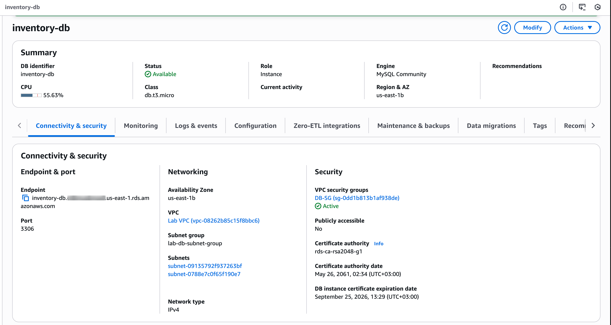

- Return to the browser tab with the Inventory application, and enter these values:
  - ***Endpoint***: Paste the endpoint you copied earlier:

  - **Database:** `inventory`
  - **Username:** `admin`
  - **Password:** `lab-password`
- Choose **Save**

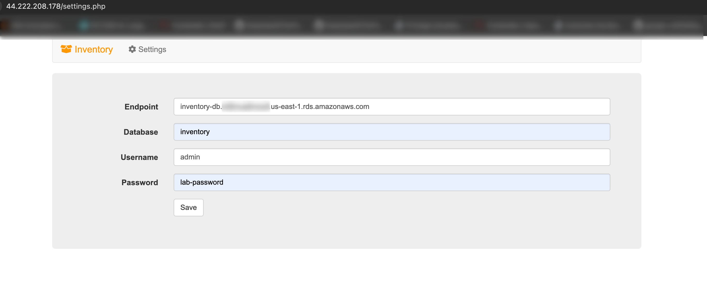

- Choose ***Save*** after filling in the details.

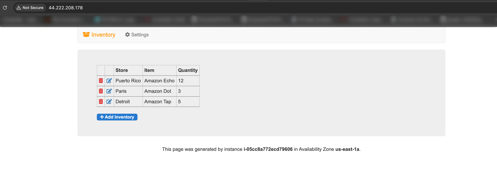

> [!TIP]
The application stores this information into AWS Secrets manager as a Secret and uses it to connect to the database, load some initial data, and display instance information. Secrets Manager helps you improve your security posture, because you no longer need hard-coded credentials in application source code. You replace hard-coded credentials with a runtime call to the Secrets Manager service to retrieve credentials dynamically when you need them.

- Add inventory,  edit, and delete inventory information by using the web application.
  - The inventory information is stored in the Amazon RDS MySQL database that you created earlier in the lab. This means that any failure in the application server will not lose any data. It also means that multiple application servers can access the same data.

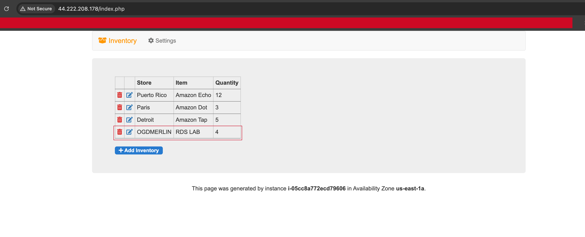

You have now ***successfully*** launched the application and connected it to the database!

## Lab complete

***Congratulations***! You have completed the lab.
