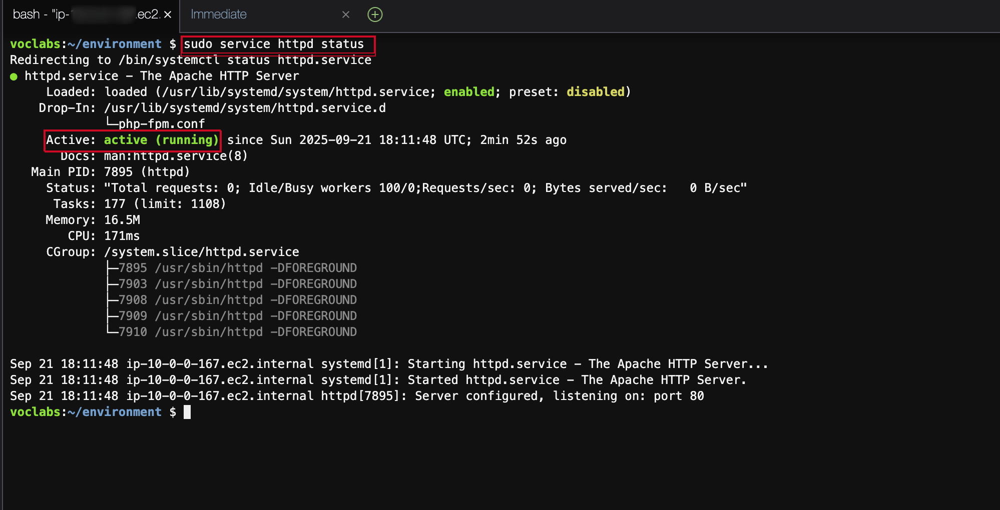

# Lab: Creating a Dynamic Website for the Café


## Lab Objectives

In this lab, you will deploy an application on an Amazon Elastic Compute Cloud (Amazon EC2) instance. The application gives the café the ability to accept online orders. After testing that the application works as intended in the first AWS Region (the development environment), you will then create an Amazon Machine Image (AMI) from the EC2 instance. You will also deploy a second instance of the same application as the production environment in another AWS Region.

After completing this lab, you should be able to do the following:

- Connect to the AWS Cloud9 integrated development environment (IDE) on an existing EC2 instance.

- Analyze the EC2 instance environment and confirm web server accessibility.

- Install a web application on an EC2 instance that also uses AWS Secrets Manager.

- Test the web application.

- Create an AMI.

- Deploy a second copy of the web application to another AWS Region.

*At the end of this lab, your architecture should look like the following example*:


## A business request for the café: Preparing an EC2 instance to host a website (challenge #1)

The café wants to introduce online ordering for customers and give café staff the ability to view submitted orders. Their current website architecture, where the website is hosted on Amazon S3, does not support the new business requirements.

In the first part of this lab, you take on the role of Sofía. You configure an EC2 instance so that it is ready to host a website for the café.

### Task 1: Analyzing the existing EC2 instance

- On the AWS Management Console, in the search box, enter and choose EC2 to open the Amazon EC2 console.

- Choose ***Instances***.

Notice the running instance. This EC2 instance was created when the lab was started.


### Task 2: Connecting to the EC2 instance using AWS Cloud9

AWS Cloud9 is service that can run on an EC2 instance. It provides an IDE that includes features such as a code editor, debugger, and terminal.

By using the AWS Cloud9 IDE, you don't need to download a key pair and connect to the EC2 instance by using PuTTY or similar Secure Shell (SSH) software. By using AWS Cloud9, you also don't need to use command line text-editing tools (such as vi or nano) to edit files on the Linux instance.

- On the browser tab with these instructions, from the AWS Details window, copy the value for Cloud9url, and paste it into a new browser tab to open the AWS Cloud9 console.

You are now connected to the AWS Cloud9 IDE that is running on the EC2 instance that you observed earlier.

- The IDE includes the following:

  - A bash terminal in the bottom-right panel.

  - A file browser in the left panel that shows files in the /home/ec2-user/environment directory on the instance.

  - A file editor in the upper-right panel. If you select a file in the file browser, such as the README.md file, it displays in the editor.


### Task 3: Analyzing the LAMP stack environment and confirming that the web server is accessible

Recall that the objective of this challenge lab is to configure an EC2 instance to host the new dynamic website for the café. In this task, you analyze what is already installed.

- To observe the operating system version, in the AWS Cloud9 bash terminal, run the following command:

```bash
cat /proc/version
```

> [!NOTE]  
*Notice how the output indicates that it is an Amazon Linux instance roughly analogous to Red Hat 7*

- To observe the web server, PHP details, and server state, run the following commands:

```bash
sudo httpd -v
service httpd status
php --version
```

> [!IMPORTANT]  
*The output should show the versions of the web server and that they are not currently running*.


- To start the web server, install the database, and set them to start automatically after any future EC2 instance restarts, run the following commands:

```bash
sudo chkconfig httpd on
sudo service httpd start
sudo service httpd status
#verify database
sudo mariadb --version
sudo systemctl enable mariadb
#
sudo chkconfig mariadb on
sudo service mariadb start
sudo service mariadb status
```

> [!IMPORTANT]
Confirm that the output shows that both services are running.




> [!WARNING]  
After running these commands, if the terminal doesn't show a prompt, press *Q*

- To configure the EC2 instance so that you can use the AWS Cloud9 editor to edit web server files, run the following commands:

```bash
ln -s /var/www/ /home/ec2-user/environment
sudo chown ec2-user:ec2-user /var/www/html
```

The first command creates a symlink from the default AWS Cloud9 editor workspace to the /var/www directory that contains your web server files

The second command changes ownership of the html subdirectory so that the ec2-user (which you are logged in as) can edit and create new files in it.

Next, you create a test webpage.

- In the file browser, expand the CafeWebServer > www directory, and choose the html directory.

- Choose File > New File.

- In the text editor tab, paste the following line:

```html
<html>Hello from the café web server!</html>
```

> [!TIP]  
Make the website accessible from the internet.
In the Amazon EC2 console, locate the public IPv4 address of the EC2 instance. In a new browser tab, enter `http://<public-ip>` and replace ** with the public IPv4 address, and open the page. Does the message that you entered into index.html file load in the browser?
*To allow inbound HTTP traffic on TCP port 80 from anywhere, update the Source in the security group of the EC2 instance as needed*.


## New business requirement: Installing a dynamic website application on the EC2 instance (challenge #2)

In the previous challenge, you configured the EC2 instance. You now know that PHP is installed and that the application environment has a running relational database. Also, the environment has a running web server that can be accessed from the internet. You now have the basic setup for hosting a dynamic website for the café.

In the second part of this lab, you take on the role of Sofía and install the café application on the EC2 instance.

### Task 4: Installing the café application

To download and extract the web server application files, run the following commands:

```bash
cd ~/environment
```

```bash
wget https://aws-tc-largeobjects.s3.us-west-2.amazonaws.com/CUR-TF-200-ACACAD-3-113230/03-lab-mod5-challenge-EC2/s3/setup.zip
unzip setup.zip
```

```bash
wget https://aws-tc-largeobjects.s3.us-west-2.amazonaws.com/CUR-TF-200-ACACAD-3-113230/03-lab-mod5-challenge-EC2/s3/db.zip
unzip db.zip
```

```bash
wget https://aws-tc-largeobjects.s3.us-west-2.amazonaws.com/CUR-TF-200-ACACAD-3-113230/03-lab-mod5-challenge-EC2/s3/cafe.zip
unzip cafe.zip -d /var/www/html/
````

```bash
cd /var/www/html/cafe/
```

```bash
wget https://docs.aws.amazon.com/aws-sdk-php/v3/download/aws.zip
wget https://docs.aws.amazon.com/aws-sdk-php/v3/download/aws.phar
unzip aws -d /var/www/html/cafe/
chmod -R +r /var/www/html/cafe/
```

Notice how the file browser now shows the .zip files that you downloaded.

You also extracted these archive files, which created the cafe, db, and setup directories in your work environment.

Next, you observe how the application is designed to work.

- To open the www/html/cafe/Psr/index.php source code file in the AWS Cloud9 editor, select (double-click) the file.

Notice that this file has HTML code in it, but it also contains sections that are enclosed in  elements. These elements make calls to other systems and resources. For example, on line 18, you see that the PHP code references a file named getAppParameters.php.


- Open the getAppParameters.php file in the code editor.

Notice on line 3 of this file that the AWSSDK is invoked.

In the subsequent sections, the web application creates a client that connects to Secrets Manager. The application then retrieves seven parameters from Secrets Manager. Those parameters have not been created in Secrets Manager yet, but you do that next.

- To configure the application parameters, in the bash terminal, run the following commands:

```bash
cd 
cd environment/setup
./set-app-parameters.sh
```


- After the script runs, it should show that seven parameters were created.


The shell script that we just ran issues AWS Command Line Interface (AWS CLI) commands. These commands add the secrets that the application will use from *Secrets* Manager.

- On the AWS Management Console, in the search box, enter and choose *Secrets* Manager to open the *Secrets* Manager console

- In the left navigation pane, choose ***Secrets***.

There are now seven parameters stored as *secrets*.

> [!NOTE]  
It might take a few minutes for these parameters to be stored as *secrets*. If you don't see the *secrets*, wait a few minutes, and choose ***Refresh***.

The café application's PHP code references these values (for example, so that it can retrieve the connection information for the MySQL database).

- Choose the /cafe/dbPassword parameter.

- Choose Retrieve secret value, and copy this value to your clipboard.

- To configure the MySQL database to support the café application, in the AWS Cloud9 bash terminal, run the following commands:

```bash
cd ../db/
./set-root-password.sh
./create-db.sh
```

Next, you observe the database tables that were created.

```bash
mysql -u admin -p
```

- When you are prompted for the database password, paste the dbPassword parameter value that you copied.

  - You should now see a mysql> prompt, which indicates that you are now connected to the MySQL database that runs on this EC2 instance.


- To observe the contents of the database (specifically, the tables that support the café web application), run the following commands:

```sql
show databases;
use cafe_db;
show tables;
select * from product;
exit;
```


- To update the time zone configuration in PHP, in the bash terminal, run the following commands:

```bash
sudo sed -i "2i date.timezone = \"America/New_York\" " /etc/php.ini
sudo service httpd restart
```

The first command configures the time zone in the PHP software.

The second command restarts the web server so that the web server notices the configuration update.

> [!IMPORTANT]  
To test whether the café website is working and can be accessed from the internet, in a new browser tab, enter `http://<public-ip>/cafe` and replace `<public-ip>` with the public IPv4 address of the EC2 instance.


> [!IMPORTANT]  
Make sure the test page at `http://<public-ip>/` loads, so you know that the web server works and is accessible from the internet.
You also know that the MySQL database is running and contains tables and data to support the application.

- `http://<public-ip>/cafe`

> [!CAUTION]  
When you think you have fixed the issue, load the `http://<public-ip>/cafe` page again. Does it load completely so that you can see the café menu items? If so, ***congratulations***!

### Task 5: Testing the web application

In this task, you test placing an order.

In the browser tab where you have the `http://<public-ip>/cafe` page open, choose Menu.

Submit an order for at least one of the menu items displayed.

> [!NOTE]  
You might need to scroll down to find the Submit Order button.

Return to the menu page and place another order.

Go to the Order History page to see the order details for all the orders that you placed

## New business requirement: Creating development and production websites in different AWS Regions (challenge #3)

Everyone at the café is impressed with the new dynamic website that Sofía created. Customers are delighted that they can now place online orders and schedule dessert items for pickup. Customer satisfaction has increased because of reduced wait times.

However, another business requirement emerges, along with the praise. Martha and Frank would like to have two café websites:

One website that can be used as a development environment to mock up new features and web designs before they are released to customers

A separate website that hosts the production environment that customers use

Sofía discusses the new requirement with Mateo, an AWS systems administrator and engineer, when he comes into the café one morning for his coffee. He suggests that, ideally, the two environments would exist in different AWS Regions. Such a design would have the added benefit of providing more robust disaster recovery (DR) in the unlikely scenario when an AWS Region becomes temporarily unavailable.

Sofía is now very busy! As she accomplishes more impressive work, her skills become more in-demand.

### Task 6: Creating an AMI and launching another EC2 instance

Because the café website already runs well on an existing EC2 instance, Sofía decides to duplicate it by creating an AMI from it. She then launches a new instance from the new AMI.

You continue to take on the role of Sofía for this task. Before you create an AMI out of this instance, you should create a new key pair, which might be important to have later in this lab.

- To set a static internal hostname and create a new key pair on the EC2 instance, in the bash terminal, run the following commands, ensure that you are on prompt  `voclabs:~/environment $`, if not , used `cd ..`

```bash
sudo hostname cafeserver
ssh-keygen -t rsa -f ~/.ssh/id_rsa
```

- For the two times that you are prompted for a passphrase, press Enter.

- To make the new key available to the SSH utilities, in the bash terminal, run the following command:

```bash
cat ~/.ssh/id_rsa.pub >> ~/.ssh/authorized_keys
```


- In the AWS Management Console, browse to the Amazon EC2 console, and then select the instance.

- Choose Actions > Images and templates > Create image.


Next, you configure the new AMI.

- On the Amazon EC2 console, in the Create Image page, for Image name, enter CafeServer.

- Choose Create Image.

- From the navigation menu, choose AMIs, and wait until the image status becomes Available. The process typically takes about 2 minutes.


On the navigation menu, you might need to expand Images to find AMIs.

Create an AMI in another AWS Region.

- In this step, your objective is to create a new EC2 instance from the AMI that you just captured. However, you must create the new instance in the Oregon (us-west-2) AWS Region.


- In the upper-right corner of the Amazon EC2 console, choose the Region selector, and then choose US West (Oregon).


> [!TIP]  
Copy the AMI ID of the image that you just created. Then, try to find it in the Oregon (us-west-2) Region.
Select the AMI you that you created in the AWS Region where you created it. Next, choose the Actions menu. Do any actions seem like they could help you make the AMI available in the Oregon (us-west-2) Region? Choose the appropriate action. After you initiate it, the action might take up to 5 minutes to complete. Choose the refresh icon occasionally to check when it has completed.

Next, you create the new café instance from your AMI.

- To create the new café instance from your AMI, make sure you are in the Oregon Region, and configure the following options:
  - For Name and tags, choose Add additional tags, and configure the following options
    - For Key, enter Name.

    - For Value, enter ProdCafeServer.

  - For Instance type, choose t2.small.

  - For Key pair (login), choose Proceed without a key pair. The key pair that you created earlier in this lab should work to connect to it if necessary.

  - For Network settings, choose Edit, and configure the following options:
    - For VPC, choose the default VPC.

    - For Subnet, choose a public subnet, such as subnet-0bb1c79de3EXAMPLE.

  - For Security Security group name, enter cafeSG, and configure the following options:
    - Set TCP port 22 so that it is open to anywhere.
    - Set TCP port 80 so that it is also open to anywhere.

Choose Launch instance.

- Wait for the new instance to have a Public IPv4 DNS value assigned to it even if the status of the instance is still not Available.

Copy the Public IPv4 DNS value. You use it soon.


Next, you create the needed Secrets Manager secrets in the new AWS Region.

- Return to the ***AWS Cloud9 IDE*** in the N. Virginia (us-east-1) Region, and open the CafeWebServer/setup/set-app-parameters.sh file in the text editor.

- Edit line 15 of the file to match this setting:

```bash
region="us-west-2"
```

- Edit line 21 to match this setting (where `<public-dns-of-ProdCafeServer-instance>` is the DNS of the ProdCafeServer instance):

```bash
publicDNS="`<public-dns-of-ProdCafeServer-instance>`"
```

> [!NOTE]  
 Note: The line should still contain the quotation marks, but it should not contain the brackets (< >).
This example shows what line 15 should look like and how line 21 should be formatted. However, the value of your public DNS will be different.


> [!TIP]  
By changing the AWS Region details and running this script again, you create the same parameters that you created earlier in the us-east-1 Region of Secrets Manager. However, this time, you created these parameters in the Oregon Region.

### Task 7: Verifying the new café instance  

- Return to the EC2 Console in the Oregon Region, and verify that the new ProdCafeServer instance is running.


- Copy the Public IPv4 address, and load it in a web browser.

  - The Hello from the cafe web server! message should display.

- Load the `http://<public-ip>/cafe/` URL in a browser tab.

  - The entire café website should display.


- Load the Menu page.

  - The full Menu page should load, and the order-placing functionality should work


- Place an order to verify that the website is working as intended.


## Update from the café

Sofía is now a hero at the cafe. She created a dynamic website, and she also created a duplicate version of the same website that runs in a second AWS Region.

Sofía decides to designate the first EC2 instance that she created—the one in the us-east-1 Region—as the development instance. The second instance she created—the one in the Oregon (the us-west-2) Region—is the production instance.

This way, Sofía and any other application developers can test application enhancements on the development site without affecting the production site. Then, when the developers decide that the enhancements look good and they have fully tested them, they can migrate the code to the production site.

Sofía explained to Frank and Martha what she had done. They were pleased to know that the website can now take online orders. They were also glad to hear that they can now test new enhancements to the website without immediately exposing those changes to customers.

## Conclusion

***Congratulations***, you have successfully done the following:

- Connected to the AWS Cloud9 IDE on an existing EC2 instance.

- Analyzed the EC2 instance environment and confirmed web server accessibility.

- Installed a web application on an EC2 instance that also uses Secrets Manager

- Tested the web application.

- Created an AMI.

- Deployed a second copy of the web application to another AWS Region.

## Lab complete

 ***Congratulations***! You have completed the lab.
